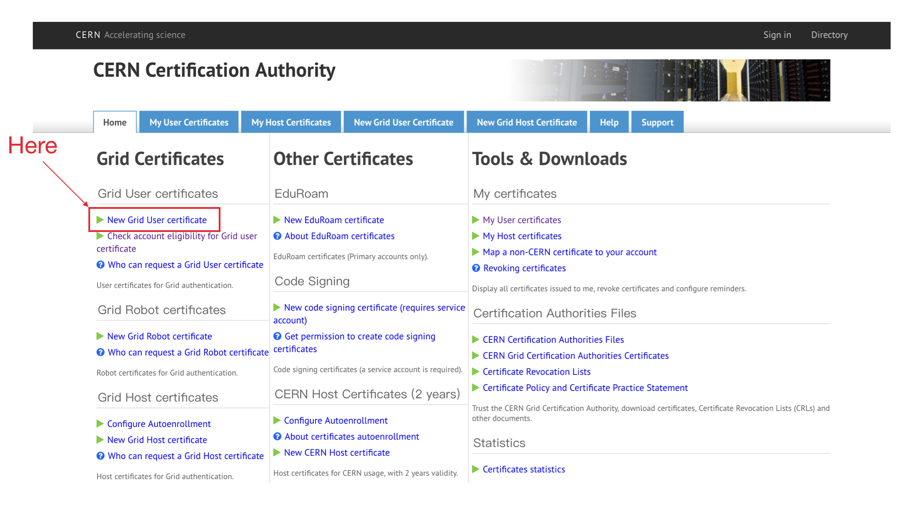
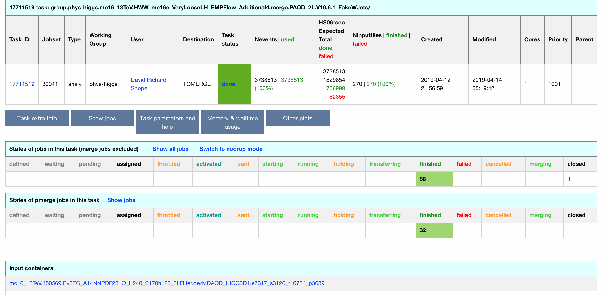

# Grid

## Introduction

We always work with the grid services to run the samples on the grid. The tutorial for grid system is shown [here](https://indico.cern.ch/event/757797/timetable/?view=standard#b-309103-the-grid-and-getting).

## Grid certificate

The instruction to apply for Grid certificate and ATLAS VO is described [here](https://twiki.cern.ch/twiki/bin/viewauth/AtlasComputing/SoftwareTutorialSoftwareBasics#Grid_Certificates). After you follow the instruction to install the certificate to Lxplus, you can start to use `rucio` to download the files to your CERNBox directory. Moreover, we should include the certificate in your browser to visit some websites like [ATLAS BigPanda](https://bigpanda.cern.ch/) and [AMI](https://ami.in2p3.fr/).

### Hands-on sessions

* Log in to [https://ca.cern.ch/ca/](https://ca.cern.ch/ca/) and follow the instruction to generate the `.p12` certificate file.



* When you generate and download the certificate file in your local laptop. Then, you need to send them to the Lxplus.

```bash
scp myCertificate.p12 youraccount@lxplus.cern.ch:.
```

* You need to convert your certificate into the correct form using

```bash
openssl pkcs12 -in mycert.pfx -clcerts -nokeys -out usercert.pem
openssl pkcs12 -in mycert.pfx -nocerts -out userkey.pem
chmod 400 userkey.pem
chmod 444 usercert.pem
```

* Move the `userkey.pem` and `usercert.pem` to the `~/.globus`.

```text
mv userkey.pem ~/.globus
mv usercert.pem ~/.globus
```

You can check that everything is working by doing

```
setupATLAS
diagnostics
gridCert
```

If you get the following in the end of the results, then you are totally fine with the grid system. You can then enjoy working with them!

```bash
  Step Test Description                                   Result
     1 Permissions certificate/key                         OK
     2 Setting up grid software                            OK
     3 Certificate validity                                OK
     4 Key / Certificate match                             OK
     5 Check grid proxy                                    OK
     6 Authenticate voms server                            OK
     7 Role check                                          OK
     8 Nickname check                                      OK
     9 Pandaserver connect check                           OK
    10 AMI access check                                    OK
    11 Rucio Information                                   OK
```

## Grid submission

### Introduction

We monitor our jobs on the [**ATLAS BigPanda**](https://bigpanda.cern.ch/). There are several types for the jobs. The most frequent types are 

* **done**: completely run successfully
  * _You can download them_ 
* **finished**: ****run successfully but part of the jobs fail
  * _You need to re-run with the same commands_ 
* **broken**: cannot run ****successfully 
  * _You need to debug the errors and re-run after cleaning all the bugs_ 
* **aborted**: job is aborted \(killed\) by user

The followings are the examples of the status of the jobs. 


#### Clarification

You will find there are still some of _fail_ events, but they've already been re-run automatically. So, don't worry that there are some lost of the events if the status is done.



#### Find the output container to download

* Click the name of job


* Find out the section of output container


* Then download the `2LDF` container for final states of 2 different-flavor leptons. The command is described in the [bottom section](grid.md#rucio-1). 

```text
rucio download group.phys-higgs.mc16_13TeV.HWW_mc16e_VeryLooseLH_EMPFlow_Additional4.merge.PAOD_2L.V19.6.1_FakeWJets_PAOD_2LDF/
```

## Rucio

Here are tutorial and twiki about `rucio`. Please find the instructions below.

* [Official rucio website](https://rucio.readthedocs.io/en/latest/)
* [Twiki for rucio](https://twiki.cern.ch/twiki/bin/view/AtlasComputing/SoftwareTutorialGettingDatasets)
* [Slides for rucio](https://indico.cern.ch/event/757797/contributions/3141910/attachments/1735918/2807718/Overview_of_Rucio_-_ATLAS_Software_Tutorial_10_2018.pdf)

### Initialization \(do every time when login\)

```bash
setupATLAS
lsetup rucio
voms-proxy-init -voms atlas
```

### Useful Commands

The full description for the rucio can be found [here](https://rucio.readthedocs.io/en/latest/man/rucio.html). I summarize some frequently used commands in the followings:

#### list

```text
rucio ls <container>
```

#### search containers with some specific strings, for example,

This is will provide the containers with prefix with `group.phys-higgs:group.phys-higgs.` and then you can find which you would like to use 

```text
rucio ls group.phys-higgs:group.phys-higgs.*
```

#### list files in the container

```text
rucio list-files <container>
```

#### download files

```text
rucio download <root file or container>
```

#### download random files \(`num` represent an integer\)

```text
rucio download --nrandom num <container>
```

## Hands-on sessions

### Rucio

Take HWW V19 samples in the ATLAS Panda as example, for data15 samples, we have a container called`group.phys-higgs:group.phys-higgs.data15_13TeV.HWW_VeryLooseLH.merge.PAOD_2L.V19.0_FakeWJets_PAOD_2LDF`

And now we can check the existence of the container for data15,

```text
rucio ls group.phys-higgs:group.phys-higgs.data15_13TeV.HWW_VeryLooseLH.merge.PAOD_2L.V19.0_FakeWJets_PAOD_2LDF/
```

Then, we can list the files and the total size of this container

```text
rucio list-files group.phys-higgs:group.phys-higgs.data15_13TeV.HWW_VeryLooseLH.merge.PAOD_2L.V19.0_FakeWJets_PAOD_2LDF
```

If you just want to randomly download some of the samples in the container, said 10 of them, 

```text
rucio download --nrandom 10 group.phys-higgs:group.phys-higgs.data15_13TeV.HWW_VeryLooseLH.merge.PAOD_2L.V19.0_FakeWJets_PAOD_2LDF
```

Of course, you can download the whole dataset in this container

```text
rucio download group.phys-higgs:group.phys-higgs.data15_13TeV.HWW_VeryLooseLH.merge.PAOD_2L.V19.0_FakeWJets_PAOD_2LDF
```

If you want to share the datasets with others after downloading the datasets, you could follow the instruction in the [CERNBox section](cernbox.md#sharing).

