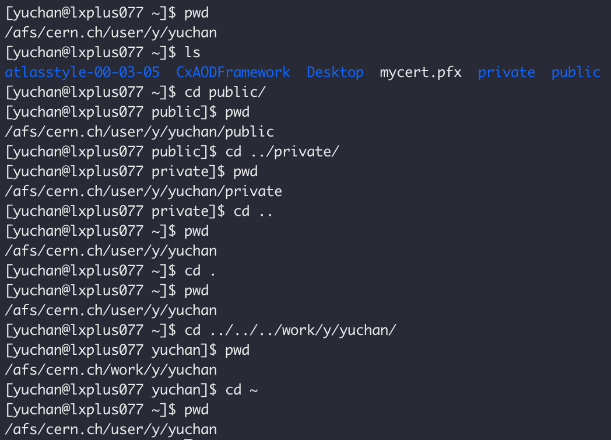
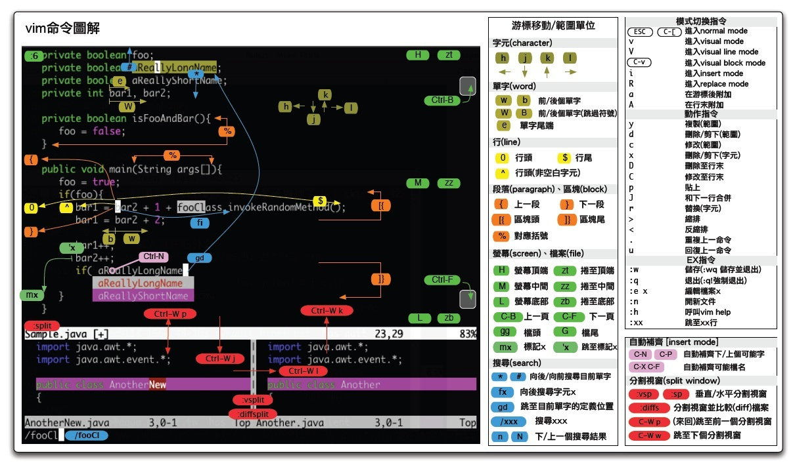
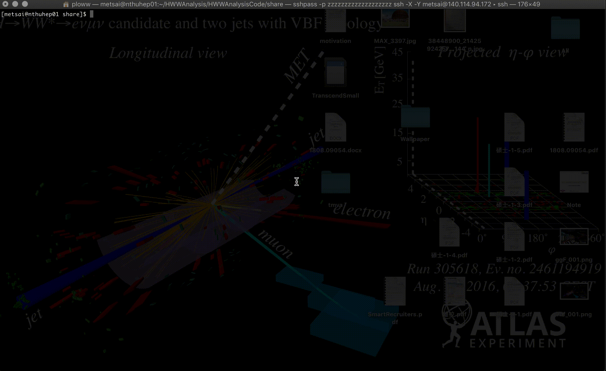

# Linux \(Basic\)

## 打開終端機（terminal）

### Mac

用spotlight搜尋"terminal"就能找到終端機的app，直接點擊開即可

如果希望顯示遠端的影像，則須額外安裝X window，而Mac常用的X window是：

* [XQuartz](https://www.xquartz.org/)

### Windows

使用Windows系統則需另外安裝以下SSH client端，此程式主要是利用SSH來連結server，當中有兩個較好用的軟體：

* [MobaXterm](https://mobaxterm.mobatek.net/)
* [PuTTY](https://www.putty.org/)

MobaXterm的好處是內建FTP上傳下載的功能，因此並不需額外使用FTP的程式，也不需要自己用scp指令來下載檔案，並且MobaXterm的功能十分健全跟強大！

另外，Windows系統中常用的X window軟體則為：

* [Xming](http://www.straightrunning.com/XmingNotes/)

## 進入terminal後，實際你正在使用shell

進入terminal後，一般預設會使用bash shell，也有人會改用zsh shell，而以下所介紹的指令們，**就是bash shell中的指令**！

進入terminal的身份分為**一般使用者**跟**superuser** \(用來管理系統所使用的帳號\)。而root是superuser常見的帳號 \(這裡不是CERN所用的軟體ROOT喔！\)，一般server會關閉以root身份登入server，如果要使用root，一般會要求使用者先用自己的帳號登入，再透過指令轉換成root身份。

而可以使用的指令一般會儲存在以下兩個資料夾底下

* user為主的指令一般會儲存在`/usr/bin`底下
* root所擁有的指令一般會儲存在`/bin`底下

另外我們可以透過這些選項的權限來知道使用者有哪些指令可以使用。詳情請見以下ls的介紹。

## pwd - 查看當前路徑

pwd = Print Working Directory

```bash
pwd
```

而pwd所顯示的**絕對路徑**，而路徑\(path\)有分為什麼種類呢？

而路徑分為兩種，有**絕對路徑**及**相對路徑**。[\[1\]](https://dotblogs.com.tw/im_sqz777/2017/07/26/220713)

* **絕對路徑** \(Absolute path\)：絕對路徑是一個絕對位置，他不會隨著檔案位置的變換而改變他的路徑。
* **相對路徑** \(Relative path\)**：**是相對於現在目錄的路徑表示，也就是你現在這個檔案在哪裡，這個目錄的路徑起始點就在哪裡，所以每個檔案的相對路徑起始點都可能會不同。

## ls - 列出檔案資訊

ls = list

```bash
ls
```

加上 option -a = list all 會列出 **每個檔案/資料夾**

```bash
ls -a
```

加上 option -l 會列出 **詳細資訊**

```bash
ls -l
```

可以合起來用，例如：  
同時加上 option -a 和 -l 會列出 **每個檔案/資料夾** 的 **詳細資訊**

```bash
ls -al
```

我們可以遞迴地\(recursively\)看底下資料夾的資訊

```text
ls -R
```

## cd - 切換資料夾/前往路徑

cd = Change Directory

cd 後面可以加 絕對路徑 也可以加 相對路徑

```bash
cd 欲前往的路徑
```

讓我們再複習一次，**路徑有兩種！**

#### 絕對路徑

就是你 pwd 完看到的那種，標示從根目錄至該處的路徑

#### 相對路徑

* 使用者的家目錄：~（蟲蟲）
* 表示當前路徑：. （一個點）
* 表示當前路徑的上一層路徑：.. （兩個點）

### Example



## vim 或 emacs - 編輯器

這世界上的編輯器流派只有三個，一派是Emacs，一派是Vim，剩下的都是其他

Vim：編輯器之神  
Emacs：神之編輯器

雖然Jennifer都用emacs，但是因為我用vim所以我要來介紹vim，耶

簡單來說只要知道以下指令就可以使用了：

* vim &lt;fileName&gt; 可以進入vim編輯器修改檔案
* 按 i 可以進入編輯模式
* 按 esc 可以離開編輯模式
* 按 :w 可以儲存
* 按 :q 可以離開vim編輯器


欲知更多可以看下面這張圖（希望大家不要看了圖之後就拒絕使用vim）



或是看點動畫檔可能會更好懂

[https://vimgifs.com/](https://vimgifs.com/)

最後分享一個很棒的 vim 教學結束這回合！（Better, Stronger, Faster！）

[https://coolshell.cn/articles/5426.html](https://coolshell.cn/articles/5426.html)

## 建議！

### 每個指令都看起來這麼長，怎麼辦？

在Bash中打指令的時候，我們有一個很實用的建議，也就是可以透過鍵盤上的Tab鍵，Tab鍵有什麼用處呢？

先說個例子，底下有兩個檔案，一個叫apple，另一個叫application，如果我們只打appl就按了Tab鍵，那他正常就會沒辦法判斷你是想要輸入哪一個，因此可以按兩下Tab鍵來顯示有什麼東西是一樣由app為開頭的字，這時如果我們希望輸入的是application，那我們只需要再多按一個"i鍵"，接下來再按Tab鍵，我們就會得到application了。

以下提供一個真實的例子，當我們在用HWW analysis code的時候，因為各種設定檔案放在不同資料夾當中，並且會有很多層，因此Tab鍵的功能就會變得很重要。

例如，你現在有一個檔案儲存在以下的位置中

```text
share/config/samples/XSec/common/XS_13TeV.csv
```

而你待在share這個資料夾當中，如果你剛好想要使用剛學到的vim指令修改這個檔案，沒有伴隨著Tab鍵的使用，你就必須要把完整路徑記下來並且一個字一個字的打！**然而使用Tab鍵的話，我們可以很快的把指令完整打上去。**

而使用的方法跟規則如下，

我們首先先打頭幾個字元，如果沒有相同開頭的字，按Tab之後，後面的就會出現。如果有相同開頭的字，就會跳出選項給你看。Tab鍵不只在檔案跟路徑可以用，連Bash的指令也是可以用的喔！  
例如你想要打source這個指令，你打sou再按一下Tab鍵，就會跑出source囉！

以下是我們實際的例子，怎麼快速地打出

```bash
vim share/config/samples/XSec/common/XS_13TeV.csv
```



## Reference

\[1\] [https://dotblogs.com.tw/im\_sqz777/2017/07/26/220713](https://dotblogs.com.tw/im_sqz777/2017/07/26/220713)


