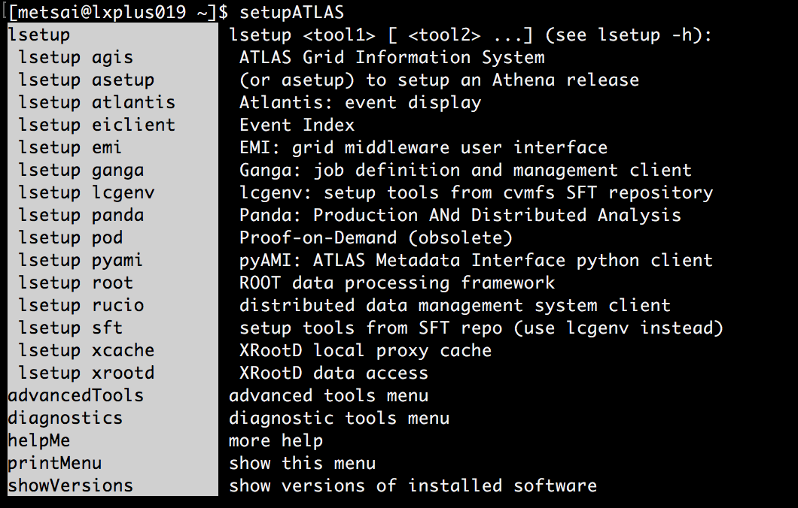

# Lxplus

## Introduction 

[Lxplus](https://lxplusdoc.web.cern.ch/lxplusdoc/) \(Linux Public Login User Service\) is the interactive logon service to Linux for all CERN users. We normally work with Lxplus since the environments in the Lxplus are finely set with the ATLAS experiment. It could interact to the eos system and CERNBox, which are used to stored dataset. 

### Working in the Lxplus  

Once you have CERN account, we can access the Lxplus by the following commands:

#### Log in Lxplus with different systems

Log in Lxplus with CentOS CERN 7 \(CC7\)

```bash
ssh yourAccount@lxplus.cern.ch​
```

Log in Lxplus with Scientific Linux 6 \(SLC 6\) 

```bash
ssh yourAccount@lxplus6.cern.ch
```

#### Log in specific node of Lxplus 

For example, you can log in some specific node \(lxplus616\) by `ssh`

```
ssh yourAccount@lxplus616.cern.ch​
```

### Commands in the Lxplus

#### Set up for the ATLAS environment

You should initialize with the following command when you login every time

```bash
setupATLAS
```



### Useful commands in the Lxplus

* Check the quota in user or working directory 

```bash
fs lq --human
```

## Hand-on sessions

### Log in the Lxplus


```bash
ssh yourAccount@lxplus.cern.ch​
```


