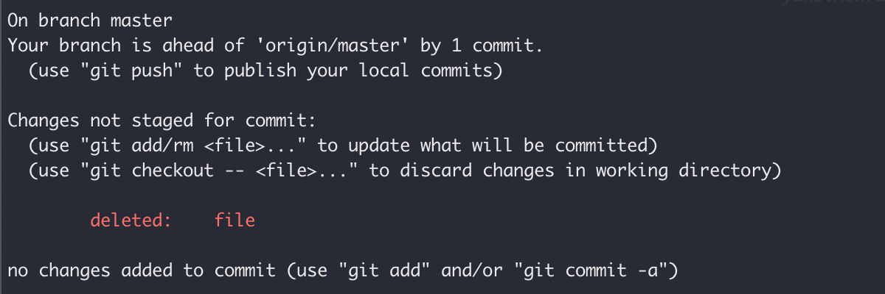

# Git Intro

## **請先跟我一起想像：**

你的 git 資料夾是一個房子，裡面有很多家具。  
你手上有一台神奇的數位相機，正在對著這個房子的內部拍照。

在數位相機的預覽畫面中，你可以選擇要不要把這個東西拍進去，  
「我等一下拍照要拍進這張桌子」像是這樣。  
選好要拍什麼東西之後，按下快門，就會拍下照片放入相簿。


為貼近生活經驗，比喻內容對於實際git的運作方式會有描述不夠精確的地方，重點是希望大家能藉此以理解基本概念！


## **對應到git指令/術語：**

* 家具 = 資料夾內的檔案/資料夾
* 加入等一下要拍進去的東西 = git add
* 按下快門 = git commit
* 一張照片 = 一個 commit
* 從修改到記錄的三個階段
  * 房子 = Working Space
  * 相機預覽 = Staging Area
  * 相簿 = Repository

## **因此，上面的描述換成git的操作會變成：**

你的 git 資料夾是一個 Working Space（房子），  
裡面有很多 files/directories（家具）。  
你使用 git（手上有一台神奇的數位相機），  
對這個資料夾做版本控制（對著這個房子的內部拍照）。

在 Staging Area（數位相機的預覽畫面）中，  
你可以 git add（選擇要不要把這個東西拍進去）。

```bash
# 把新增的檔案 thisTable 加入 Staging Area
git add thisTable
```

（「我等一下拍照要拍進這張桌子」像是這樣）。  
選好要在commit裡加入什麼東西（拍什麼東西）之後，

```bash
git commit -m "description of this commit"
```

git commit（按下快門），  
就會馬上產生一個commit（拍下照片）記錄進repository（放入相簿）。

## 除此之外你或許會想知道：

#### 要怎麼查看Staging Area（相機預覽）的內容？

```bash
git status
```

#### 要怎麼查看之前做過的commit們（相簿裡的相片們）的內容？

```bash
git log
# 加上 --oneline 的話，每個commit都只會show一行資訊
git --oneline log
```

#### 我可以一次 git add 很多檔案嗎？

```bash
git add file1 file2
```

#### 我剛剛git add myfile但我反悔了，可以把檔案移出Staging Area嗎？

```bash
git reset HEAD myfile
```


**把檔案移出Staging Area 為什麼不是用 git rm？**

git rm 的用途是把「在repository有過記錄（曾經commit過）但已經不在working space裡」的檔案從repository裡刪除。  
詳情請見下方例子。


## 舉個例子

在 git 資料夾裡新建一個檔案 "file" 後，查看 git 狀態

```bash
git status
```


此時 file 在 working space 裡但不在 staging area 裡。  
接下來把 file 加入 staging area

```bash
git add file
```


此時 file 在 working space 裡也在 staging area 裡但還沒 commit。  
把 file 移出 staging area

```bash
git reset HEAD file
```


就回到 git add 前的狀態了。（file 在 working space 裡但不在 staging area 裡）  
把 file 再次加回 staging area 並 commit

```bash
git add file
git commit -m "create file"
```


此時再次查看 git 狀態

```bash
git status
```


working space, staging area 和 repository 三處同步。  
（file 在 working space 裡也在 staging area 裡也 commit 紀錄了。）  
把 file 刪除再查看 git 狀態

```bash
rm file
git status
```



file 在 working space 裡已經被刪除，但 staging area 裡還不知道「file 已被刪除」這項資訊。  
此時就是使用 git rm 的時機啦！

```bash
git rm file
git status
```


file 在 working space 裡被刪除，staging area 也知道了這項資訊，最後就是用 commit 紀錄下這個變更。

```bash
git commit -m "delete file"
```


再次查看狀態

```bash
git status
```


三處再次同步，小鎮又恢復了平靜，感謝飛天小女警的努力。

