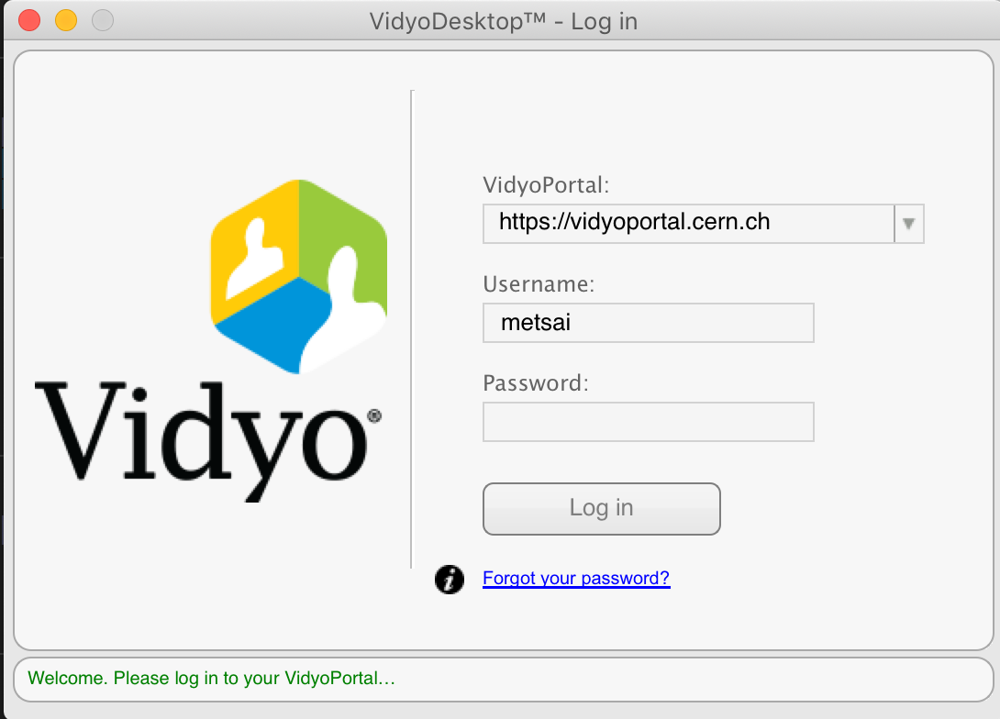
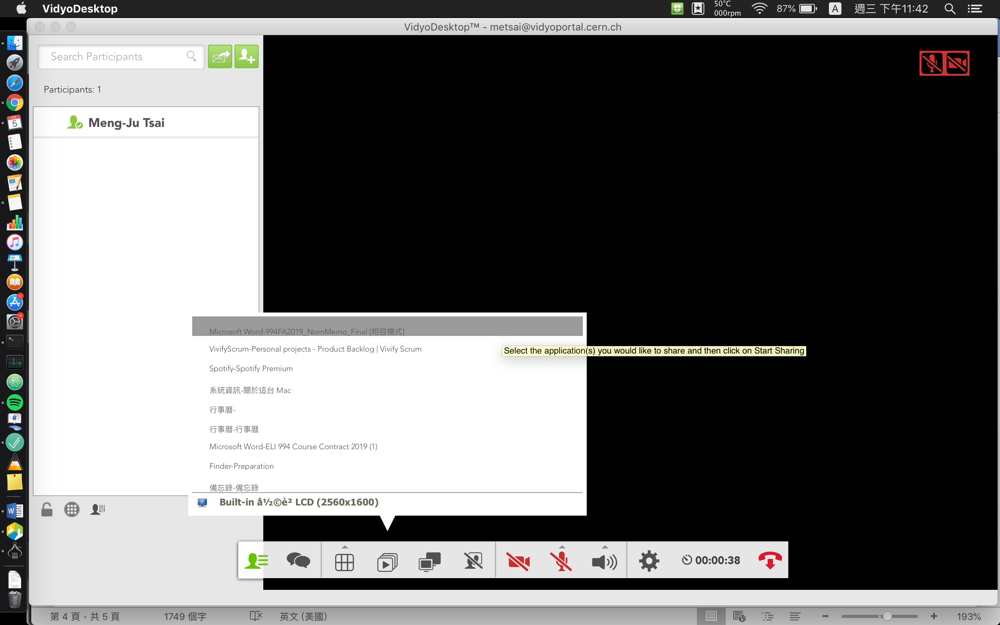

# Physics Analysis in ATLAS

## Introduction

Physics analysis in the ATLAS experiment covers a wide range of topics and requires several skills. 

* We analyze data with Linux system, Python, C/C++ and some different programming languages. 
* We use physical observables \(feature\) to select signal phase spaces.
* We use **histograms** with specific observables and **cutflows** in different phase spaces as our results to describe physics. 
* We **summarize our results in the slides** and present the results in the online meetings.

### Programming

Here I listed some basic but very useful links for introduction. Many _jargon_ are explained in the following links. 

#### Twiki

* \*\*\*\*[**The ATLAS Physics Analysis Workbook**](https://twiki.cern.ch/twiki/bin/view/AtlasProtected/PhysicsAnalysisWorkBook)
  * [Physics Analysis Workbook: Release 21](https://twiki.cern.ch/twiki/bin/view/AtlasProtected/PhysicsAnalysisWorkBookRel21)
  * [Physics Analysis Workbook: Release 20](https://twiki.cern.ch/twiki/bin/view/AtlasProtected/PhysicsAnalysisWorkBookRel20)

#### Tutorials

* [ATLAS Software Tutorial](https://atlassoftwaredocs.web.cern.ch/ABtutorial/)
* [ATLAS Software Tutorial meetings](https://indico.cern.ch/category/397/)

### ATLAS important links

#### Meetings and talks

* **General**
  * \*\*\*\*[**ATLAS weekly meetings**](http://metsai.web.cern.ch/metsai/meetings/distributions/ATLAS-weekly-meetings.html)\*\*\*\*
  * \*\*\*\*[ATLAS talks \(seminar\)](https://twiki.cern.ch/twiki/bin/view/AtlasPublic/PublicSeminars)
  * [ATLAS Conference talks](http://atlas-speakers-committee.web.cern.ch/atlas-speakers-committee/)
  * \*\*\*\*[**ATLAS Physics and Performance \(P&P\) meetings**](http://metsai.web.cern.ch/metsai/meetings/distributions/ATLAS-physics-performance-meetings.html)\*\*\*\*
  * \*\*\*\*[ATLAS Physics Coordinate meetings](http://metsai.web.cern.ch/metsai/meetings/distributions/ATLAS-physics-coordination-meetings.html)
* **Combined Performance \(CP\)**
  * \*\*\*\*[**ATLAS PMG meetings**](http://metsai.web.cern.ch/metsai/meetings/distributions/ATLAS-PMG-meetings.html)\*\*\*\*
  * [ATLAS Flavour Tagging meetings](http://metsai.web.cern.ch/metsai/meetings/distributions/ATLAS-Flavour-tagging-meetings.html)
  * [ATLAS Trigger meetings](http://metsai.web.cern.ch/metsai/meetings/distributions/ATLAS-Trigger-meetings.html)
  * \*\*\*\*[ATLAS Muon CP meetings](http://metsai.web.cern.ch/metsai/meetings/distributions/ATLAS-Muon-CP-meetings.html)
  * [ATLAS Tau CP meetings](http://metsai.web.cern.ch/metsai/meetings/distributions/ATLAS-Tau-CP-meetings.html)
  * [ATLAS Tracking CP meetings](http://metsai.web.cern.ch/metsai/meetings/distributions/ATLAS-Tracking-CP-meetings.html)
  * [ATLAS Egamma CP meetings](http://metsai.web.cern.ch/metsai/meetings/distributions/ATLAS-Egamma-CP-meetings.html)
  * [ATLAS JetEtMiss CP meetings](http://metsai.web.cern.ch/metsai/meetings/distributions/ATLAS-JetEtMiss-CP-meetings.html)
* **Physics analysis**
  * \*\*\*\*[**ALTAS Higgs WG meetings**](http://metsai.web.cern.ch/metsai/meetings/distributions/ATLAS-Higgs-WG-meetings.html)\*\*\*\*
  * \*\*\*\*[ALTAS Exotics meetings](http://metsai.web.cern.ch/metsai/meetings/distributions/ATLAS-Exotics-meetings.html)
  * [ATLAS SUSY meetings](http://metsai.web.cern.ch/metsai/meetings/distributions/ATLAS-SUSY-meetings.html)
  * \*\*\*\*[ATLAS Statistics and ML meetings](http://metsai.web.cern.ch/metsai/meetings/distributions/ATLAS-Statistics-ML-meetings.html)

#### Publication and notes

* [ATLAS paper \(all\)](https://twiki.cern.ch/twiki/bin/view/AtlasPublic/Publications)
* [ATLAS paper \(by energy/productions/channels\)](https://twiki.cern.ch/twiki/bin/view/AtlasPublic/WebHome#Physics_Analysis_Groups_Summary)
* [ATLAS Public Note](https://twiki.cern.ch/twiki/bin/view/AtlasPublic/PUBnotes)
* [ALTAS Conference Note](https://twiki.cern.ch/twiki/bin/view/AtlasPublic/CONFnotes)

#### Glance

[Glance](https://glance.cern.ch/atlas/) is a useful tool to search for the status of membership, publication, or even institutions. 

## Hand-on sessions

### Join meetings by vidyo

We use [**vidyo**](http://information-technology.web.cern.ch/services/fe/vidyo) to connect online meetings. It provides services on different platforms including Mac OS, Windows, Linux and IOS. 

To log in, you should key the following string in the _**VidyoPortal**_ blank shown below, and then login with your CERN account and its password. 

```text
https://vidyoportal.cern.ch
```



#### Share your slides

如果是用Mac系統，記得不要把vidyo變成全螢幕的，要把vidyo跟你想要放的投影片放在_桌面_，如此才能找到你的投影片並分享。




