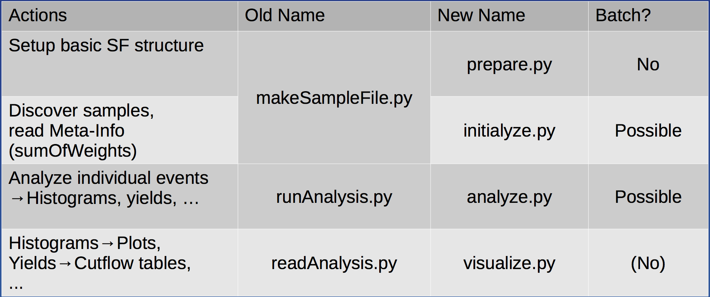

# HWW Analysis Code

## Introduction

The [HWW Analysis Code](https://gitlab.cern.ch/atlas-physics/higgs/hww/HWWAnalysisCode) is the analysis framework for the H→WW analysis. The structure of HWW framework is shown below.


### Analysis steps

We have four steps to analyze and get results from the PxAOD samples. Normally, we don't modify these four python files. Instead, we should change the **configuration files**, which are the **arguments with suffix .cfg** in the commands, ****to change the setups how we would like to analyze. 

* [prepare.py](https://gitlab.cern.ch/atlas-physics/higgs/hww/HWWAnalysisCode/blob/master/share/prepare.py):  setup basic **SampleFolder** \(SF\) structure.
* [initialize.py](https://gitlab.cern.ch/atlas-physics/higgs/hww/HWWAnalysisCode/blob/master/share/initialize.py): discover samples and read Meta-Info \(sumOfWeights\).
* [analyze.py](https://gitlab.cern.ch/atlas-physics/higgs/hww/HWWAnalysisCode/blob/master/share/analyze.py): analyze individual events as well as book histograms  yields.
* [visualize.py](https://gitlab.cern.ch/atlas-physics/higgs/hww/HWWAnalysisCode/blob/master/share/visualize.py): draw the histograms and cutflow tables.

The following table summarizes the usage of these four steps. This table is from [Ralf's slides](https://indico.cern.ch/event/771763/contributions/3207844/attachments/1767899/2871281/caf_tutorial_concepts.pdf) in the CAF tutorial.



## Hand-on session

### Setup the analysis framework

As a start of the analysis, we should start setup the HWW analysis code. The instruction is described in the bottom of the [repository](https://gitlab.cern.ch/atlas-physics/higgs/hww/HWWAnalysisCode/tree/master). Please follow the instruction to setup the framework. 

#### Troubleshooting

Since this analysis framework is contributed by anyone in this group, although it requires merge requests for new updates, it may still possibly fail to build or run the analysis code. 

Once you found some issues, you can **ask about the issues in the group emails or persons who push the latest commits**. Moreover, if you are urgent or reluctant to ask about them, you could just try to [`checkout`](../../../../git/basic-git-local.md#git-checkout-qie-fen-zhi)  an older version in the commits, which work normally without problems.

We can switch to an older commit \(version\) of the framework

```text
git checkout <older commit>
```

where `<older commit>` means a string of the commit, for example, something like `fddaae9`. 

After switching to an older commit, you can follow the instruction to setup again. Notice that you _should redo all the steps_ in the instruction which means you should **delete the build folder, and create a new build folder and recompile again!**

### Run the example analysis

After building your framework, we could first run the example analysis with the following steps. We have four step to get results from the PxAOD samples shown as below. 


```bash
cd ../HWWAnalysisCode/share
./prepare.py config/master/ZjetsFF/prepare-ZjetsFakeFactor-Coupling-2018.cfg
./initialize.py config/master/ZjetsFF/initialize-ZjetsFakeFactor-Coupling-2018.cfg
./analyze.py config/master/ZjetsFF/analyze-ZjetsFakeFactor-Coupling-2018.cfg
./visualize.py config/master/ZjetsFF/visualize-ZjetsFakeFactor-Coupling-2018.cfg
```

#### Check your first results!

Once you have the histograms and cutflows, it will be convenient to review all your results in your laptops since it will be very slow to use Lxplus to open and view your histograms. Therefore, you should download the results from Lxplus to your local laptops. 

Here we could follow the tutorial for [scp](../../../../connect_to_the_server/linux-advanced.md#scp) and [ftp](../../../../connect_to_the_server/linux-advanced.md#ftp-service) and download our results to your laptops. 

```bash
scp -r youraccount@cern.ch:/<path to your results>/<your results>
```

Here the option `-r` is to recursively download your folder. If the folder contains many files, you could consider to [collect them into a tarball](../../../../connect_to_the_server/linux-advanced.md#tar-da-bao). 

#### 

