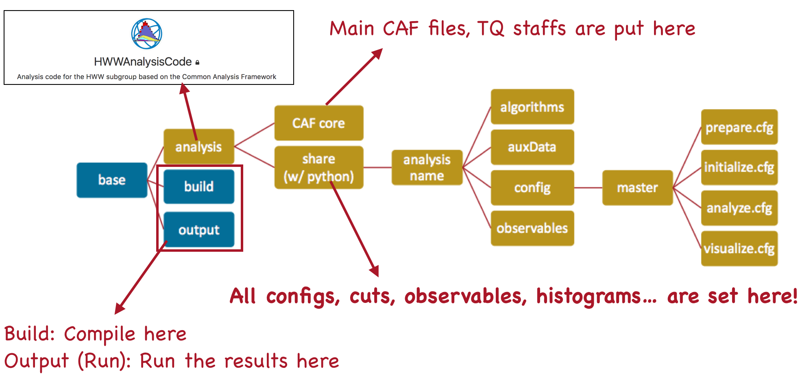

# HWW Analysis Code

## Introduction

The [HWW Analysis Code](https://gitlab.cern.ch/atlas-physics/higgs/hww/HWWAnalysisCode) is the analysis framework for the H→WW analysis. The structure of HWW framework is shown below.



### Analysis steps

We have four steps to analyze and get results from the PxAOD samples. Normally, we don't modify these four python files. Instead, we should change the **configuration files**, which are the **arguments with suffix .cfg** in the commands, ****to change the setups how we would like to analyze. 

* [prepare.py](https://gitlab.cern.ch/atlas-physics/higgs/hww/HWWAnalysisCode/blob/master/share/prepare.py):  setup basic **SampleFolder** \(SF\) structure.
* [initialize.py](https://gitlab.cern.ch/atlas-physics/higgs/hww/HWWAnalysisCode/blob/master/share/initialize.py): discover samples and read Meta-Info \(sumOfWeights\).
* [analyze.py](https://gitlab.cern.ch/atlas-physics/higgs/hww/HWWAnalysisCode/blob/master/share/analyze.py): analyze individual events as well as book histograms  yields.
* [visualize.py](https://gitlab.cern.ch/atlas-physics/higgs/hww/HWWAnalysisCode/blob/master/share/visualize.py): draw the histograms and cutflow tables.

The following table summarizes the usage of these four steps. This table is from [Ralf's slides](https://indico.cern.ch/event/771763/contributions/3207844/attachments/1767899/2871281/caf_tutorial_concepts.pdf) in the CAF tutorial.


## Hand-on session

### Setup the analysis framework

As a start of the analysis, we should start setup the HWW analysis code. The instruction is described in the bottom of the [repository](https://gitlab.cern.ch/atlas-physics/higgs/hww/HWWAnalysisCode/tree/master). Please follow the instruction to setup the framework. 

#### Troubleshooting

Since this analysis framework is contributed by anyone in this group, although it requires merge requests for new updates, it may still possibly fail to build or run the analysis code. 

Once you found some issues, you can **ask about the issues in the group emails or persons who push the latest commits**. Moreover, if you are urgent or reluctant to ask about them, you could just try to `checkout`  an older version in the commits. 

Move to an older commit \(version\) of the framework

```text
git checkout <olderversion>
```

Move back to the master version

```text
git checkout master
```

Moreover, we can also change between the temporary versions we just switch to \(just like `cd -`\)

```text
git checkout -
```

#### Options

