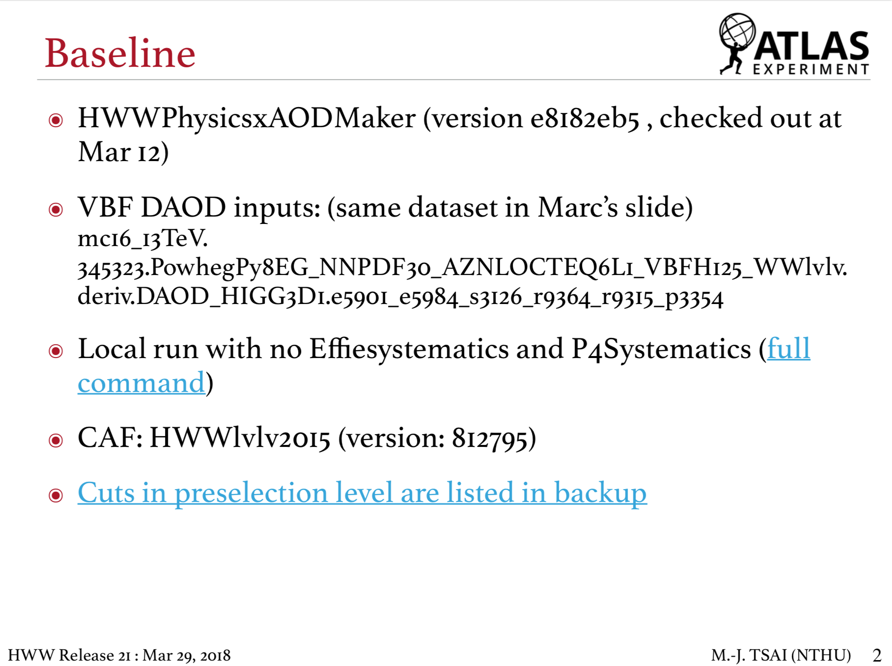
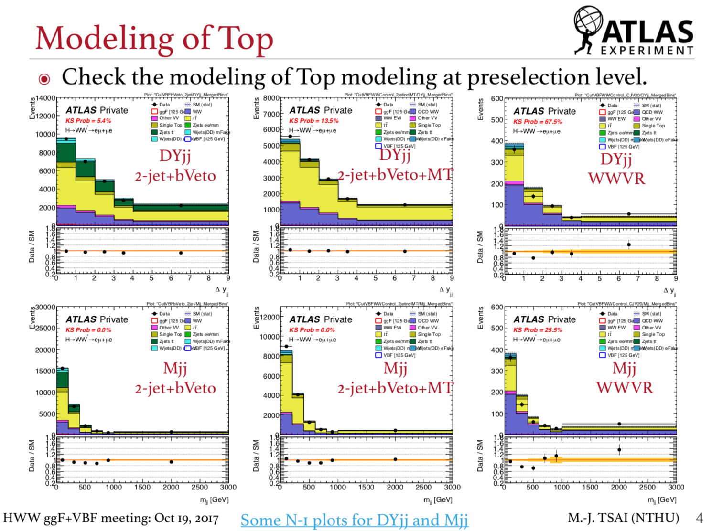

# Documents

## Recommendation for slides

Since we present the results and discuss the physics by slides, clear and detailed slides are important and required. Moreover, we're not native speakers, therefore, we should let the audiences easily understand your fantastic results and what you're talking about. Here, I try to summarize some of tips to follow. Hope it will help for you to make a good presentations. 

### Tips

* Always put your baseline in the introduction or backup to make people know what you've done. For example, you should mention
  * the commit \(version\) of the analysis/production codes
  * the versions of the samples you run like R21, V19 PxAOD or EMTopo etc. 
  * your specific configurations to finish your work
  * difference between your setup and master branch

* Always put clear and conspicuous texts on the histograms and cutflows to let audience read your slides easily. With what you want to show, you can mention like
  * the flavor of the final states like ee, μμ, eμ or μe. 
  * the cut stage \(phase space\) where the histogram is
  * the physical observables used in the histograms
* Highlight bins if there are something new, interesting or problematic.

* Calculate the [cut efficiencies ](../physics_analysis/jargons.md#analysis)for the selections you're working on. When discussing selections, **mention cut efficiencies** instead of mentioning the terms, _many, some, little and a lot, ...etc._
* Always put the commits or version of the analysis

## Posters

#### TPS 2019

* [Estimation of the WW Background and Possible Improvement in the H→WW\* Analysis with the Atlas Detector](https://drive.google.com/file/d/14xImdVBoQZHqFIZdcodx_E0g0pKV8MUk/view?usp=sharing)

#### TPS 2018

* [Estimation of WW Background in the H→WW\* Analysis with the ATLAS Detector](https://drive.google.com/file/d/1PrEomiuHYetZCXbeF_qHZpmws60qW_16/view?usp=sharing)

## Thesis template

I have put the [GitHub link](https://github.com/mengjutsai/NTHU-HEP-Master-Thesis) for Latex template of the thesis. You may clone the repository and write you thesis from scratch. 

## 

